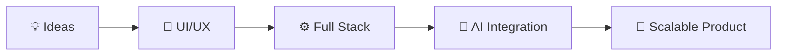

<div align="center">


<p align="center">
<a href="https://www.linkedin.com/in/debaprasad-sha/" target="_blank">
    
  </a>
   <a href="mailto:debaprasadsha98@gmail.com">
    
  </a>
  <a href="https://github.com/DEBAPRASAD-SHA" target="_blank">
    
  </a>
</p>


</div>

## 🧠 About Me

```javascript
const DEBAPRASAD = {
    LOCATION:     "📍 Bhubaneswar, Odisha, India 🇮🇳",
    ROLE:         "💻 Full-Stack Developer",
    CURRENTFOCUS: ["⚛️ React.js", "▲ Next.js", "🟢 Node.js", "🤖 AI Integration"],
    PASSION:      "🎨 Building modern, animated & responsive web applications",
    MISSION:      "🚀 Bridge AI × Web Development — build products that matter",
    MINDSET:      "🧠 Always curious about new frameworks & technologies",
    SUPERPOWER:   "✨ Turning TEA into perfect interfaces",
    PHILOSOPHY:   "Great design + Clean code = Magic 💫",
    OPENTO:       ["🤝 Collaborations", "💼 Freelance", "🌱 Open Source"],
};
```
## 🛠️ Tech Stack

<div align="center">

### ⚛️ Frontend


### 🟢 Backend & Database


### 🎨 Animation & Design


### 🤖 AI & Emerging Tech


### 🔧 Tools & DevOps


<hr style="border:1px solid #444;">

 <h1 align="left"> ⚡ Project Vision </h1>

<div align="center">


<hr style="border:1px solid #444;">
</div>
</div>

<!-- <picture>
  <source media="(prefers-color-scheme: dark)"
    srcset="https://raw.githubusercontent.com/DEBAPRASAD-SHA/DEBAPRASAD-SHA/output/github-snake-dark.svg" />
  
</picture> -->

<div align="center">


**💻 Made with 💙 by DEBAPRASAD SHA — Bhubaneswar, India**

</div>
